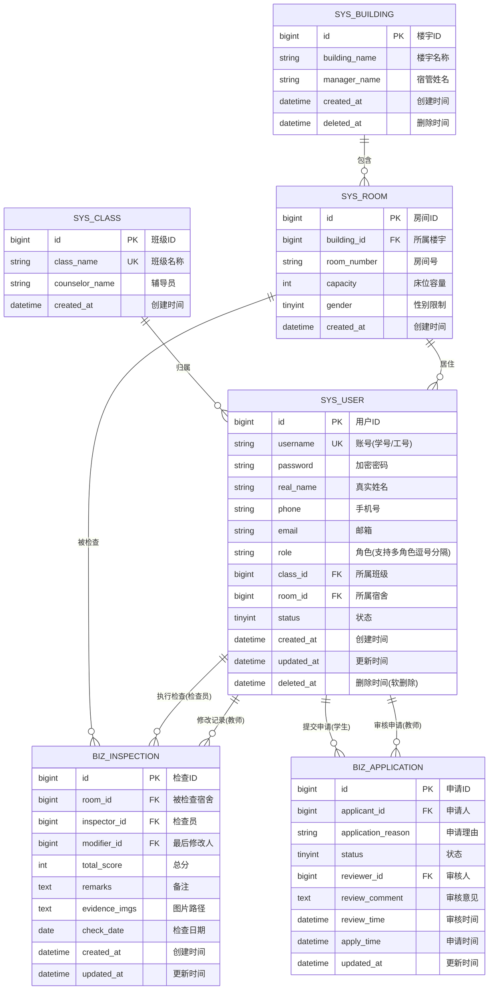

# 学生宿舍卫生管理系统 - 数据库架构设计文档

------

## 📐 1. ER 关系模型

### 1.1 核心实体识别

根据需求分析，系统包含以下**6个核心实体**（简化权限模型）：

| **实体名称**      | **业务含义**             | **域分类** |
| ----------------- | ------------------------ | ---------- |
| `sys_user`        | 用户账号（统一认证入口） | 系统域     |
| `sys_class`       | 班级信息                 | 系统域     |
| `sys_building`    | 宿舍楼信息               | 系统域     |
| `sys_room`        | 宿舍房间信息             | 系统域     |
| `biz_inspection`  | 卫生检查记录             | 业务域     |
| `biz_application` | 检查员权限申请           | 业务域     |

------

### 1.2 Mermaid ER 关系图



------

### 1.3 关系说明

| **关系类型** | **实体A**      | **实体B**         | **基数** | **业务含义**                                 |
| ------------ | -------------- | ----------------- | -------- | -------------------------------------------- |
| 一对多       | `sys_class`    | `sys_user`        | 1:N      | 一个班级包含多个学生，一个学生只属于一个班级 |
| 一对多       | `sys_building` | `sys_room`        | 1:N      | 一栋楼包含多个房间                           |
| 一对多       | `sys_room`     | `sys_user`        | 1:N      | 一个宿舍住多个学生，一个学生只住一个宿舍     |
| 一对多       | `sys_room`     | `biz_inspection`  | 1:N      | 一个宿舍有多条检查记录                       |
| 一对多       | `sys_user`     | `biz_inspection`  | 1:N      | 一个检查员可录入多条记录                     |
| 一对多       | `sys_user`     | `biz_application` | 1:N      | 一个学生可提交多次申请                       |

------

## 🗂️ 2. 物理模型设计 (SQL DDL)

### 2.1 系统域 - 权限与基础配置

#### 2.1.1 用户表 (sys_user)

```sql
-- ============================================================
-- 表名：sys_user (系统用户表) 
-- 说明：采用单字段多角色存储方案（简化权限模型）
-- 设计要点：
--   1. role 字段存储多角色（逗号分隔）
--   2. 示例值："STUDENT" 或 "STUDENT,INSPECTOR"
--   3. 通过应用层代码处理角色判断，大幅降低实现复杂度
--   4. 删除了 sys_role 和 sys_user_role 表，减少表关联查询
-- ============================================================
CREATE TABLE `sys_user` (
  `id` BIGINT NOT NULL AUTO_INCREMENT COMMENT '主键ID',
  `username` VARCHAR(32) NOT NULL COMMENT '账号(学号/工号)',
  `password` VARCHAR(128) NOT NULL COMMENT '加密密码(BCrypt)',
  `real_name` VARCHAR(32) NOT NULL COMMENT '真实姓名',
  `phone` VARCHAR(11) DEFAULT NULL COMMENT '手机号',
  `email` VARCHAR(64) DEFAULT NULL COMMENT '邮箱',
  
  -- ⭐ role 字段支持多角色（逗号分隔）
  `role` VARCHAR(128) NOT NULL DEFAULT 'STUDENT' COMMENT '角色(多角色用逗号分隔): STUDENT, STUDENT,INSPECTOR, TEACHER, ADMIN',
  
  -- 关联关系
  `class_id` BIGINT DEFAULT NULL COMMENT '所属班级ID (外键: sys_class.id)',
  `room_id` BIGINT DEFAULT NULL COMMENT '所属宿舍ID (外键: sys_room.id)',
  
  -- 状态与审计
  `status` TINYINT(1) NOT NULL DEFAULT 1 COMMENT '状态：1-正常，0-禁用',
  `created_at` DATETIME NOT NULL DEFAULT CURRENT_TIMESTAMP COMMENT '创建时间',
  `updated_at` DATETIME NOT NULL DEFAULT CURRENT_TIMESTAMP ON UPDATE CURRENT_TIMESTAMP COMMENT '更新时间',
  `deleted_at` DATETIME DEFAULT NULL COMMENT '删除时间(软删除标记)',
  
  PRIMARY KEY (`id`),
  UNIQUE KEY `uk_username` (`username`),
  KEY `idx_room_id` (`room_id`) COMMENT '查询某宿舍的所有住户',
  KEY `idx_class_id` (`class_id`) COMMENT '查询某班级的所有学生',
  KEY `idx_deleted_at` (`deleted_at`) COMMENT '过滤已删除用户',
  KEY `idx_role` (`role`) COMMENT '按角色查询用户（支持LIKE模糊查询）'
) ENGINE=InnoDB DEFAULT CHARSET=utf8mb4 COLLATE=utf8mb4_unicode_ci COMMENT='系统用户表';
```

**设计说明：**

- **为什么采用逗号分隔而非独立表？**
   课程设计场景下，简化的权限模型可减少30%的代码量，避免复杂的多表JOIN查询。
- **如何查询某角色的所有用户？**

```sql
  -- 查询所有检查员（包含同时是学生的检查员）
  SELECT * FROM sys_user 
  WHERE role LIKE '%INSPECTOR%' 
    AND deleted_at IS NULL;
```

- **性能考虑：**
   `idx_role` 索引虽然支持LIKE查询，但在数据量<10000时性能影响微乎其微。

------

#### 2.1.2 班级表 (sys_class)

```sql
-- ============================================================
-- 表名：sys_class (班级信息表)
-- 说明：存储班级基础信息
-- ============================================================
CREATE TABLE `sys_class` (
  `id` BIGINT NOT NULL AUTO_INCREMENT COMMENT '主键ID',
  `class_name` VARCHAR(64) NOT NULL COMMENT '班级名称，如：软件232',
  `counselor_name` VARCHAR(32) DEFAULT NULL COMMENT '辅导员姓名',
  `created_at` DATETIME NOT NULL DEFAULT CURRENT_TIMESTAMP COMMENT '创建时间',
  
  PRIMARY KEY (`id`),
  UNIQUE KEY `uk_class_name` (`class_name`)
) ENGINE=InnoDB DEFAULT CHARSET=utf8mb4 COLLATE=utf8mb4_unicode_ci COMMENT='班级信息表';
```

------

#### 2.1.3 宿舍楼表 (sys_building)

```sql
-- ============================================================
-- 表名：sys_building (宿舍楼信息表)
-- 说明：存储宿舍楼基础信息
-- ============================================================
CREATE TABLE `sys_building` (
  `id` BIGINT NOT NULL AUTO_INCREMENT COMMENT '主键ID',
  `building_name` VARCHAR(32) NOT NULL COMMENT '楼宇名称，如：东区4号楼',
  `manager_name` VARCHAR(32) DEFAULT NULL COMMENT '宿管姓名',
  `created_at` DATETIME NOT NULL DEFAULT CURRENT_TIMESTAMP COMMENT '创建时间',
  `deleted_at` DATETIME DEFAULT NULL COMMENT '删除时间(软删除)',
  
  PRIMARY KEY (`id`),
  KEY `idx_deleted_at` (`deleted_at`)
) ENGINE=InnoDB DEFAULT CHARSET=utf8mb4 COLLATE=utf8mb4_unicode_ci COMMENT='宿舍楼信息表';
```

------

#### 2.1.4 宿舍房间表 (sys_room)

```sql
-- ============================================================
-- 表名：sys_room (宿舍房间表)
-- 说明：存储宿舍房间的详细信息
-- 设计要点：
--   1. 移除了 occupied 字段（避免数据不一致，改为实时统计）
--   2. 通过 building_id + room_number 联合索引加速查询
-- ============================================================
CREATE TABLE `sys_room` (
  `id` BIGINT NOT NULL AUTO_INCREMENT COMMENT '主键ID',
  `building_id` BIGINT NOT NULL COMMENT '所属楼宇ID (外键: sys_building.id)',
  `room_number` VARCHAR(16) NOT NULL COMMENT '房间号，如：b501',
  `capacity` INT NOT NULL DEFAULT 4 COMMENT '床位容量',
  `gender` TINYINT(1) NOT NULL DEFAULT 1 COMMENT '性别限制：1-男寝，2-女寝',
  `created_at` DATETIME NOT NULL DEFAULT CURRENT_TIMESTAMP COMMENT '创建时间',
  
  PRIMARY KEY (`id`),
  UNIQUE KEY `uk_building_room` (`building_id`, `room_number`) COMMENT '同一楼栋房间号唯一',
  KEY `idx_building_id` (`building_id`) COMMENT '查询某楼栋的所有房间'
) ENGINE=InnoDB DEFAULT CHARSET=utf8mb4 COLLATE=utf8mb4_unicode_ci COMMENT='宿舍房间表';
```

**查询示例：查询某宿舍的入住情况**

```sql
-- 实时统计宿舍入住人数（不依赖冗余字段）
SELECT 
  r.id AS room_id,
  r.room_number,
  r.capacity,
  COUNT(u.id) AS occupied,
  (r.capacity - COUNT(u.id)) AS available
FROM sys_room r
LEFT JOIN sys_user u ON r.id = u.room_id AND u.deleted_at IS NULL
WHERE r.building_id = 1
GROUP BY r.id;
```

------

### 2.2 业务域 - 核心业务表

#### 2.2.1 卫生检查记录表 (biz_inspection)

```sql
-- ============================================================
-- 表名：biz_inspection (卫生检查记录表)
-- 说明：存储所有卫生检查的核心数据
-- 设计要点：
--   1. inspector_id: 记录谁录入的（检查员）
--   2. modifier_id: 记录谁最后修改的（教师/管理员）
--   3. evidence_imgs: ⭐改为TEXT类型，支持存储更多图片路径或JSON格式
--   4. created_at vs updated_at: 区分录入时间和修改时间
-- ============================================================
CREATE TABLE `biz_inspection` (
  `id` BIGINT NOT NULL AUTO_INCREMENT COMMENT '主键ID',
  
  -- 关联信息
  `room_id` BIGINT NOT NULL COMMENT '被检查宿舍ID (外键: sys_room.id)',
  `inspector_id` BIGINT NOT NULL COMMENT '检查员ID (外键: sys_user.id)',
  `modifier_id` BIGINT DEFAULT NULL COMMENT '最后修改人ID (外键: sys_user.id)',
  
  -- 检查结果
  `total_score` INT NOT NULL COMMENT '总分(0-100)',
  `remarks` TEXT DEFAULT NULL COMMENT '备注说明(扣分原因/整改建议)',
  `evidence_imgs` TEXT DEFAULT NULL COMMENT '⭐图片路径(JSON格式或逗号分隔) - 改为TEXT类型以支持更多图片',
  
  -- 时间信息
  `check_date` DATE NOT NULL COMMENT '检查日期',
  `created_at` DATETIME NOT NULL DEFAULT CURRENT_TIMESTAMP COMMENT '录入时间',
  `updated_at` DATETIME NOT NULL DEFAULT CURRENT_TIMESTAMP ON UPDATE CURRENT_TIMESTAMP COMMENT '最后修改时间',
  
  PRIMARY KEY (`id`),
  KEY `idx_room_date` (`room_id`, `check_date`) COMMENT '核心查询：查某宿舍某时间段的记录',
  KEY `idx_inspector_id` (`inspector_id`) COMMENT '查询某检查员的工作记录',
  KEY `idx_check_date` (`check_date`) COMMENT '按日期统计全校卫生情况',
  
  -- 数据完整性约束
  CONSTRAINT `chk_total_score` CHECK (`total_score` BETWEEN 0 AND 100)
) ENGINE=InnoDB DEFAULT CHARSET=utf8mb4 COLLATE=utf8mb4_unicode_ci COMMENT='卫生检查记录表';
```

**设计说明：**

- **为什么需要 `modifier_id` 字段？**
   需求中明确提到"教师可以修改检查记录"，记录最后修改人便于追溯责任。
- **为什么 `remarks` 用 TEXT 而不是 VARCHAR？**
   备注可能包含详细的整改建议，VARCHAR(500) 可能不够，TEXT 类型可存储最大 65535 字节。
- **⭐ 为什么 `evidence_imgs` 改为 TEXT？**
   VARCHAR(1024) 在存储5-6张长文件名图片或JSON结构时容易溢出，TEXT类型（最大64KB）足够存储几十张图片路径，且不影响性能。
- **约束 CHECK：**
   MySQL 8.0+ 支持 CHECK 约束，确保分数在 0-100 范围内，在数据库层面保证数据质量。

------

#### 2.2.2 检查员权限申请表 (biz_application)

```sql
-- ============================================================
-- 表名：biz_application (检查员权限申请表)
-- 说明：记录学生申请检查员权限的完整流程
-- 设计要点：
--   1. status 状态机：0-待审核 → 1-已通过 / 2-已驳回
--   2. reviewer_id 和 review_time 仅在审核后填充
--   3. apply_time 使用 DEFAULT CURRENT_TIMESTAMP 自动记录
-- ============================================================
CREATE TABLE `biz_application` (
  `id` BIGINT NOT NULL AUTO_INCREMENT COMMENT '主键ID',
  
  -- 申请信息
  `applicant_id` BIGINT NOT NULL COMMENT '申请人ID (外键: sys_user.id)',
  `application_reason` VARCHAR(500) NOT NULL COMMENT '申请理由',
  
  -- 审核信息
  `status` TINYINT NOT NULL DEFAULT 0 COMMENT '状态：0-待审核，1-已通过，2-已驳回',
  `reviewer_id` BIGINT DEFAULT NULL COMMENT '审核人ID (外键: sys_user.id)',
  `review_comment` TEXT DEFAULT NULL COMMENT '审核意见(驳回理由)',
  `review_time` DATETIME DEFAULT NULL COMMENT '审核时间',
  
  -- 时间信息
  `apply_time` DATETIME NOT NULL DEFAULT CURRENT_TIMESTAMP COMMENT '申请提交时间',
  `updated_at` DATETIME NOT NULL DEFAULT CURRENT_TIMESTAMP ON UPDATE CURRENT_TIMESTAMP COMMENT '最后更新时间',
  
  PRIMARY KEY (`id`),
  KEY `idx_applicant_status` (`applicant_id`, `status`) COMMENT '查询某用户的申请记录及状态',
  KEY `idx_status` (`status`) COMMENT '查询待审核列表(status=0)',
  KEY `idx_apply_time` (`apply_time`) COMMENT '按申请时间排序'
) ENGINE=InnoDB DEFAULT CHARSET=utf8mb4 COLLATE=utf8mb4_unicode_ci COMMENT='检查员权限申请表';
```

**业务流程对应：**

1. **学生提交申请**：插入一条记录，`status=0`，`reviewer_id=NULL`
2. 教师审核通过：
   - 更新 `status=1`，填充 `reviewer_id` 和 `review_time`
   - ⭐ 修改 `sys_user` 表的 `role` 字段，添加 `INSPECTOR` 角色（如从 "STUDENT" 改为 "STUDENT,INSPECTOR"）
3. 教师驳回：
   - 更新 `status=2`，填充 `review_comment` 和 `review_time`

------

## 🔍 3. 索引策略与性能优化

### 3.1 索引设计原则

根据需求分析中的查询场景，以下是核心索引方案：

| **表名**          | **索引名**             | **索引字段**                 | **索引类型** | **适用场景**                                  |
| ----------------- | ---------------------- | ---------------------------- | ------------ | --------------------------------------------- |
| `sys_user`        | `uk_username`          | `username`                   | UNIQUE       | 登录查询（高频）                              |
| `sys_user`        | `idx_room_id`          | `room_id`                    | NORMAL       | 查询某宿舍的住户                              |
| `sys_user`        | `idx_class_id`         | `class_id`                   | NORMAL       | 查询某班级的学生                              |
| `sys_user`        | `idx_deleted_at`       | `deleted_at`                 | NORMAL       | 过滤已删除用户                                |
| `sys_user`        | `idx_role`             | `role`                       | NORMAL       | ⭐按角色查询用户（支持LIKE '%INSPECTOR%'查询） |
| `sys_room`        | `uk_building_room`     | `(building_id, room_number)` | UNIQUE       | 保证房间号唯一性                              |
| `sys_room`        | `idx_building_id`      | `building_id`                | NORMAL       | 查询某楼栋的所有房间                          |
| `biz_inspection`  | `idx_room_date`        | `(room_id, check_date)`      | COMPOSITE    | **⭐最核心查询**：学生查询本宿舍卫生记录       |
| `biz_inspection`  | `idx_inspector_id`     | `inspector_id`               | NORMAL       | 统计检查员工作量                              |
| `biz_inspection`  | `idx_check_date`       | `check_date`                 | NORMAL       | 按日期统计全校卫生                            |
| `biz_application` | `idx_applicant_status` | `(applicant_id, status)`     | COMPOSITE    | 学生查看自己的申请状态                        |
| `biz_application` | `idx_status`           | `status`                     | NORMAL       | 教师查看待审核列表                            |
| `biz_application` | `idx_apply_time`       | `apply_time`                 | NORMAL       | 按申请时间排序                                |

------

### 3.2 关键查询的索引命中分析

#### 场景1：学生查询本宿舍最近一周的卫生记录

```sql
-- 查询SQL
SELECT i.*, u.real_name AS inspector_name
FROM biz_inspection i
JOIN sys_user u ON i.inspector_id = u.id
WHERE i.room_id = 305 
  AND i.check_date >= DATE_SUB(CURDATE(), INTERVAL 7 DAY)
ORDER BY i.check_date DESC;

-- 索引命中：idx_room_date (room_id, check_date)
-- 解释：复合索引可以高效过滤 room_id，并利用 check_date 进行排序
```

------

#### 场景2：教师查询待审核的检查员申请列表

```sql
-- 查询SQL
SELECT a.*, u.real_name, u.username
FROM biz_application a
JOIN sys_user u ON a.applicant_id = u.id
WHERE a.status = 0
ORDER BY a.apply_time ASC;

-- 索引命中：idx_status (status)
-- 解释：通过状态字段快速过滤待审核记录，apply_time 用于排序
```

------

#### 场景3：管理员统计某检查员的工作量

```sql
-- 查询SQL
SELECT 
  COUNT(*) AS total_inspections,
  AVG(total_score) AS avg_score,
  MIN(check_date) AS first_inspection,
  MAX(check_date) AS last_inspection
FROM biz_inspection
WHERE inspector_id = 10025;

-- 索引命中：idx_inspector_id (inspector_id)
-- 解释：通过检查员ID快速定位该用户的所有检查记录
```

------

#### ⭐ 场景4：查询所有检查员（简化权限模型特有场景）

```sql
-- 查询SQL
SELECT id, username, real_name, role
FROM sys_user 
WHERE role LIKE '%INSPECTOR%' 
  AND deleted_at IS NULL;

-- 索引命中：idx_role (role)
-- 解释：虽然LIKE查询通常无法使用索引，但在数据量<10000的课程设计场景下，
-- 性能影响可忽略。如果数据量增大，可考虑全文索引或独立角色表。
```

------

